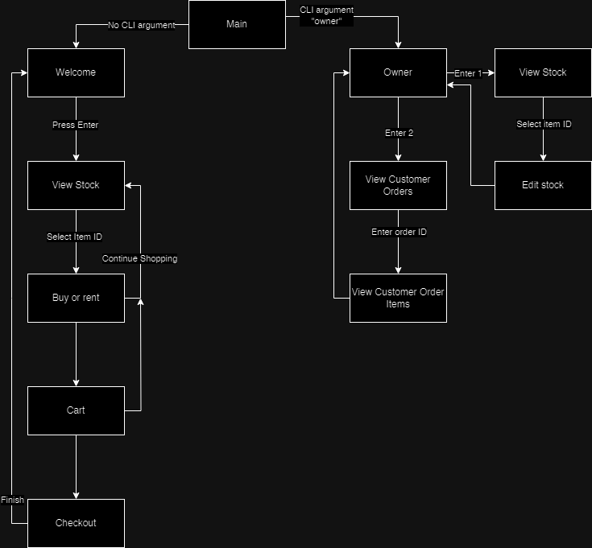
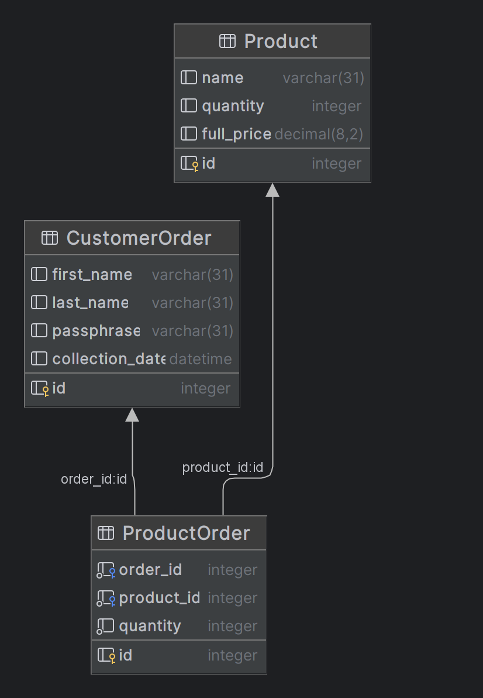
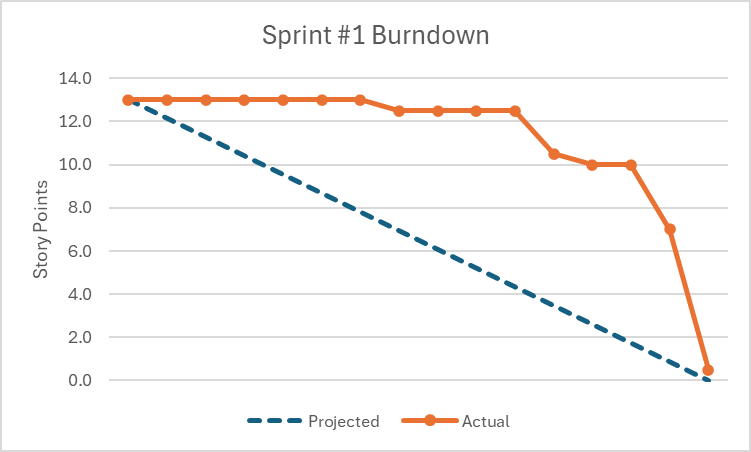

# TSI Group Project

## Project Introduction
Our product is Tubluar, a streamlined console-based application designed to optimise the holiday experience. By offering a seamless platform for renting or purchasing beach essentials directly from the command line, Tubular eliminates the need to navigate multiple applications, simplifying the process for users. Our innovative click-and-collect system ensures that customers can effortlessly pick up their orders right at the beachfront, enhancing convenience and enjoyment.

In addition, Tubular features an intuitive owner view, empowering shop owners with comprehensive tools to manage their inventory, track order details, and be prepared for customer collection times. Holidays are a time to de-stress; with Tubular, customers and staff are given an easy and efficient experience! 

## Project Architecture
Here is a general overview of our application:

Here is our SQLite DB Architecture:

Throughout the program we pass the `cart` object, this holds the users current items in the cart. We initially were going to add this to the db each time but there would be no way to differentiate it from an actual real order right now if they quit the program mid order so we opted for this attempt. The `cart` object is the same as the return from the db queries, an array of tuples for columns of the db.

## Retrospective
### Format
- We conducted our retrospective using the stop, start, continue method. This was chosen as we felt it would work well for creating actionable items.

### Issues identified in the retro:
- We need a clearer definition of when to accept PRs
- Clearer communication is needed with respect to approval of PRs
- Clearer communication is needed for approached implementation especially with overlapping/continuous work
- We should ensure work is spread across the sprint (burn down chart)
- Create uniformity across implementations in term of variables etc. There have been variations in cases used etc, which isn't promoting clean code.

### Actions
- We will hold a discussion to address uniformity in our work. In this meeting, we will clarify the style guide to be followed in the program. Following this, a helper file can be made for team members to refer to during development.
- Implementing a stand up will address multiple issues raised. In the stand up, each team member will have the opportunity to voice that they have raised a PR, or reviewed a PR. Additionally, by raising which tickets we are working on in stand up, we should minimise any duplicated work.
- By highlighting our availability in stand up, or communicating if we are struggling with work, we will be better able to spread our work across the sprint. 
- We will also look to implement a burndown chart, which can be viewed in stand up. This will allow us to identify our rate of ticket completion compared to the estimations. 
- PRs can be merged after 2 reviewers have approved it and all review comments have been addressed. Approval is achieved by commenting saying the developer has reviewed and is happy for the code to be merged.

## Class Examples
We have a branch for refactored code but this has not been merged yet [#22](https://github.com/mmcpp16/tsi-project/issues/22)
- [TableBuilder.py](https://github.com/mmcpp16/tsi-project/blob/main/group_customer/src/utils/TableBuilder.py)
- [ViewStock.py](https://github.com/mmcpp16/tsi-project/blob/main/group_customer/src/ViewStock.py)
- [DatabaseHelper.py](https://github.com/mmcpp16/tsi-project/blob/main/group_customer/src/utils/DatabaseHelper.py)

## Doubling Test
